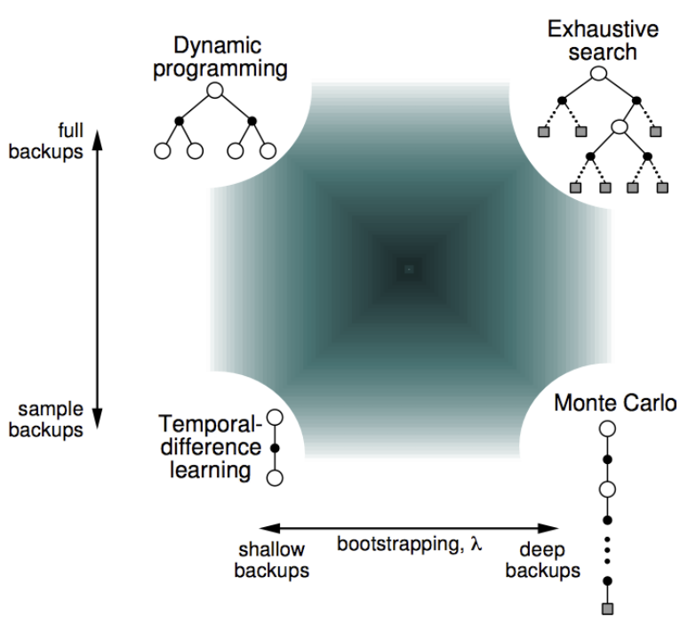
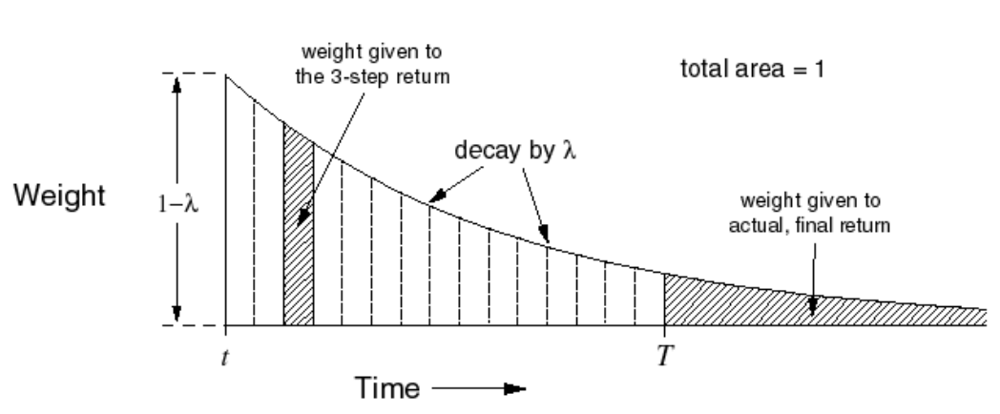
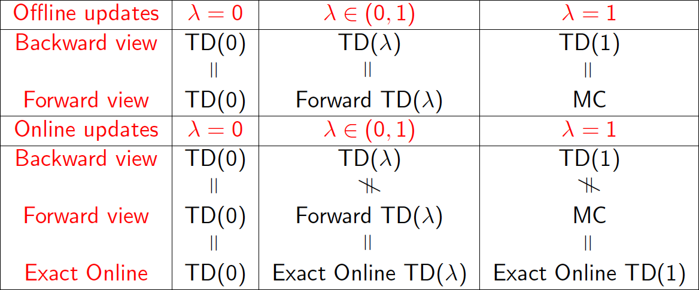
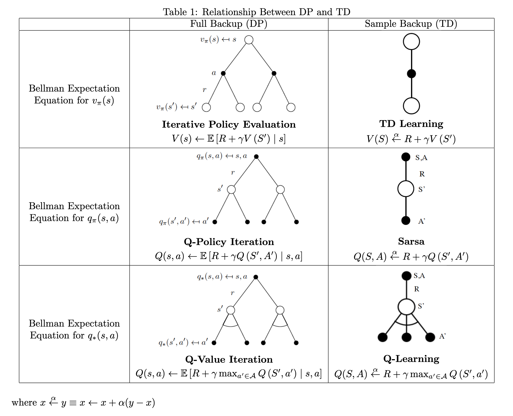
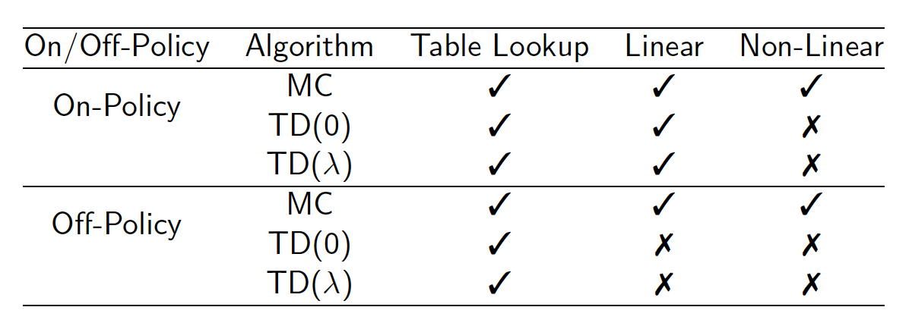
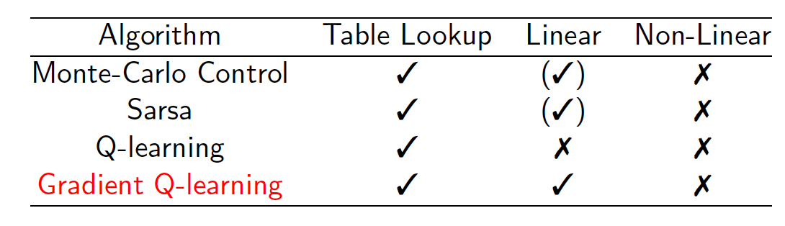
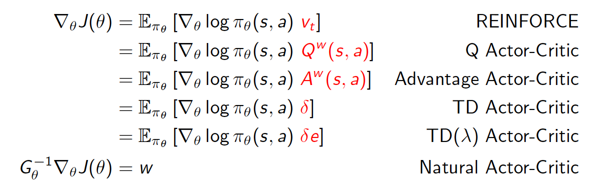

# Executive Summary
* Markov Decision Process
    * Markov Chain $\langle\mathcal{S}, \mathcal{P}\rangle$
    * Markov Reward Process $\langle\mathcal{S}, \mathcal{P}, \mathcal{R}, \gamma\rangle$
    * MDP $\langle\mathcal{S}, \mathcal{A}, \mathcal{P}, \mathcal{R}, \gamma\rangle$
        * MDP $\langle\mathcal{S}, \mathcal{A}, \mathcal{P}, \mathcal{R}, \gamma\rangle$ + policy $\pi$ = MRP $\left\langle\mathcal{S}, \mathcal{P}^{\pi}, \mathcal{R}^{\pi}, \gamma\right\rangle$
          * $\mathcal{P}_{s, s^{\prime}}^{\pi} =\sum_{a \in \mathcal{A}} \pi(a \mid s) \mathcal{P}_{s s^{\prime}}^{a}$
          * $\mathcal{R}_{s}^{\pi} =\sum_{a \in \mathcal{A}} \pi(a \mid s) \mathcal{R}_{s}^{a}$
    * Bellman Expectation Equations
    * Bellman Optimality Equations
* Planning (_Lec 3_)
    * Synchronous DP
        * Policy Iteration
            * Policy Evaluation: estimate $v_{\pi}(s)=\mathbb{E}\left[R_{t+1}+\gamma R_{t+2}+\ldots \mid S_{t}=s\right]$
                * Iterative PE: $\mathbf{v}^{k+1}=\mathcal{R}^{\pi}+\gamma \mathcal{P}^{\pi} \mathbf{v}^{k}$
            * Policy Improvement: generate $\pi' \geq \pi$
                * Greedy PI: $\pi^{\prime}(s)=\underset{a \in \mathcal{A}}{\operatorname{argmax}} q_{\pi}(s, a)$
        * Value Iteration: $v_{*}(s) \leftarrow \max _{a \in \mathcal{A}} \mathcal{R}_{s}^{a}+\gamma \sum_{s^{\prime} \in \mathcal{S}} \mathcal{P}_{s s^{\prime}}^{a} v_{*}\left(s^{\prime}\right)$
    * Asynchronous DP
        * In-place DP
        * Prioritised Sweeping
        * Real-time DP
    * Approximate DP (using function approximation)
        * Fitted Value Iteration: $\tilde{v}_{k}(s)=\max _{a \in \mathcal{A}}\left(\mathcal{R}_{s}^{a}+\gamma \sum_{s^{\prime} \in \mathcal{S}} \mathcal{P}_{s s^{\prime}}^{a} \hat{v}\left(s^{\prime}, \mathbf{w}_{\mathbf{k}}\right)\right)$ for $s \in \tilde{S} \subseteq \mathcal{S}$
            * train $\hat{v}\left(\cdot, \mathbf{w}_{\mathbf{k}+1}\right)$ using targets $\left\{\left\langle s, \tilde{v}_{k}(s)\right\rangle\right\}$
    * Contraction Mapping
* Reinforcement Learning
    * Model Free
        * Prediction (_Lec 4_)
            * Monte Carlo Policy Evaluation: $V\left(S_{t}\right) \leftarrow V\left(S_{t}\right)+\alpha\left(G_{t}-V\left(S_{t}\right)\right)$
            * TD Learning
                * TD(0): $V\left(S_{t}\right) \leftarrow V\left(S_{t}\right)+\alpha\left(R_{t+1}+\gamma V\left(S_{t+1}\right)-V\left(S_{t}\right)\right)$
                * Forward TD($\lambda$): $V\left(S_{t}\right) \leftarrow V\left(S_{t}\right)+\alpha\left(G_t^{\lambda}-V\left(S_{t}\right)\right)$
                * Backward TD($\lambda$): $V(s) \leftarrow V(s)+\alpha \delta_{t} E_{t}(s)$
                    * $E_{t}(s)=\gamma \lambda E_{t-1}(s)+\mathbf{1}\left(S_{t}=s\right)$
        * Control (_Lec 5_)
            * On-Policy
                * Monte-Carlo Policy Iteration: $Q\left(S_{t}, A_t\right) \leftarrow Q\left(S_{t}, A_t\right)+\alpha\left(G_{t}-Q\left(S_{t}, A_t\right)\right)$
                    * GLIE Monte-Carlo Control
                * SARSA: On-Policy TD Learning based Policy Iteration: $Q(S, A) \leftarrow Q(S, A)+\alpha\left(R+\gamma Q\left(S^{\prime}, A^{\prime}\right)-Q(S, A)\right)$
                    * Forward Sarsa($\lambda$): $Q\left(S_{t}, A_{t}\right) \leftarrow Q\left(S_{t}, A_{t}\right)+\alpha\left(q_{t}^{\lambda}-Q\left(S_{t}, A_{t}\right)\right)$
                    * Backward Sarsa($\lambda$): $Q(s, a) \leftarrow Q(s, a)+\alpha \delta_{t} E_{t}(s, a)$
                        * $E_{t}(s, a)=\gamma \lambda E_{t-1}(s, a)+\mathbf{1}\left(S_{t}=s, A_{t}=a\right)$
            * Off-Policy
                * Off-Policy Monte Carlo (_impractical_ as too high variance): $V\left(S_{t}\right) \leftarrow V\left(S_{t}\right)+\alpha\left(\frac{\pi\left(A_{t} \mid S_{t}\right)}{\mu\left(A_{t} \mid S_{t}\right)} \ldots \frac{\pi\left(A_{T} \mid S_{T}\right)}{\mu\left(A_{T} \mid S_{T}\right)} G_{t} - V\left(S_{t}\right)\right)$
                * Off-Policy TD Learning: $V\left(S_{t}\right) \leftarrow V\left(S_{t}\right) + \alpha\left(\frac{\pi\left(A_{t} \mid S_{t}\right)}{\mu\left(A_{t} \mid S_{t}\right)}\left(R_{t+1}+\gamma V\left(S_{t+1}\right)\right)-V\left(S_{t}\right)\right)$
                * Q-Learning: $Q(S, A) \leftarrow Q(S, A)+\alpha\left(R+\gamma \max _{a^{\prime}} Q\left(S^{\prime}, a^{\prime}\right)-Q(S, A)\right)$
    * Value Function Approximation (_Lec 6_)
        * Incremental Methods
            * Incremental Prediction $\hat{v}\left(S, \mathbf{w}\right) \approx v_\pi(S)$
                * MC: $\Delta \mathbf{w}=\alpha\left(G_{t}-\hat{v}\left(S_{t}, \mathbf{w}\right)\right) \nabla_{\mathbf{w}} \hat{v}\left(S_{t}, \mathbf{w}\right)$
                * TD(0): $\Delta \mathbf{w}=\alpha\left(R_{t+1}+\gamma \hat{v}\left(S_{t+1}, \mathbf{w}\right)-\hat{v}\left(S_{t}, \mathbf{w}\right)\right) \nabla_{\mathbf{w}} \hat{v}\left(S_{t}, \mathbf{w}\right)$
                * Forward TD($\lambda$): $\Delta \mathbf{w}=\alpha\left(G_{t}^{\lambda}-\hat{v}\left(S_{t}, \mathbf{w}\right)\right) \nabla_{\mathbf{w}} \hat{v}\left(S_{t}, \mathbf{w}\right)$
                * Backward TD($\lambda$): $\Delta \mathbf{w} =\alpha \delta_{t} E_{t}$
                    * $E_{t} =\gamma \lambda E_{t-1}+\nabla_{\mathbf{w}} \hat{v}\left(S_{t}, \mathbf{w}\right)$
            * Incremental Control
                * MC: $\Delta \mathbf{w}=\alpha\left(G_{t}-\hat{q}\left(S_{t}, A_{t}, \mathbf{w}\right)\right) \nabla_{\mathbf{w}} \hat{q}\left(S_{t}, A_{t}, \mathbf{w}\right)$
                * TD(0): $\Delta \mathbf{w}=\alpha\left(R_{t+1}+\gamma \hat{q}\left(S_{t+1}, A_{t+1}, \mathbf{w}\right)-\hat{q}\left(S_{t}, A_{t}, \mathbf{w}\right)\right) \nabla_{\mathbf{w}} \hat{q}\left(S_{t}, A_{t}, \mathbf{w}\right)$
                * Forward-view $\mathrm{TD}(\lambda)$: $\Delta \mathbf{w}=\alpha\left(q_{t}^{\lambda}-\hat{q}\left(S_{t}, A_{t}, \mathbf{w}\right)\right) \nabla_{\mathbf{w}} \hat{q}\left(S_{t}, A_{t}, \mathbf{w}\right)$
                * Backward-view $\mathrm{TD}(\lambda)$: $\Delta \mathbf{w} =\alpha \delta_{t} E_{t}$
                    * $E_{t} =\gamma \lambda E_{t-1}+\nabla_{\mathbf{w}} \hat{q}\left(S_{t}, A_{t}, \mathbf{w}\right)$
        * Batch Methods
    * Policy Gradient Methods (_Lec 7_)
        * Policy Gradient Thoerem
        * Monte-Carlo PG 
            * REINFORCE: $\nabla_{\theta} J(\theta) =\mathbb{E}_{\pi_{\theta}}\left[\nabla_{\theta} \log \pi_{\theta}(s, a) v_{t}\right]$
        * Compatible Function Approximation Theorem
            * Compatible Value Function: $\nabla_{w} Q_{w}(s, a)=\nabla_{\theta} \log \pi_{\theta}(s, a)$
        * Actor-Critic PG
            * Q AC: $\nabla_{\theta} J(\theta)=\mathbb{E}_{\pi_{\theta}}\left[\nabla_{\theta} \log \pi_{\theta}(s, a) Q^{w}(s, a)\right]$
            * Advantage AC: $\nabla_{\theta} J(\theta)=\mathbb{E}_{\pi_{\theta}}\left[\nabla_{\theta} \log \pi_{\theta}(s, a) A^{w}(s, a)\right]$
            * TD(0) AC: $\nabla_{\theta} J(\theta)=\mathbb{E}_{\pi_{\theta}}\left[\nabla_{\theta} \log \pi_{\theta}(s, a) \left(r+\gamma V^w\left(s_{t+1}\right)-V^{w}(s_t)\right)\right]$
            * Forward TD($\lambda$) AC: $\nabla_{\theta} J(\theta)=\mathbb{E}_{\pi_{\theta}}\left[\nabla_{\theta} \log \pi_{\theta}(s, a) \left(v_{t}^{\lambda}-V^w(s_t)\right) e\right]$
            * Backward TD($\lambda$) AC: $\nabla_{\theta} J(\theta)=\mathbb{E}_{\pi_{\theta}}\left[\nabla_{\theta} \log \pi_{\theta}(s, a) \delta_t e_t\right]$
		        * $e_{t} =\gamma \lambda e_{t-1} + \nabla_\theta \log \pi_\theta(s_t, a_t)$
        * Natural PG
            * Natural AC: $\nabla_{\theta}^{nat} J(\theta) = G_{\theta}^{-1} \nabla_{\theta} J(\theta) =w$
    * Model Based (_Lec 8_)
        * Model $\mathcal{M}=\left\langle\mathcal{P}_{\eta}, \mathcal{R}_{\eta}\right\rangle$ where $\mathcal{P}_{\eta} \approx \mathcal{P}$ and $\mathcal{R}_{\eta} \approx \mathcal{R}$
        * Model Learning
            * Supervised learning problem $\{S_{t}, A_{t} \rightarrow R_{t+1}, S_{t+1}\}_{t=1}^{T-1}$
                * $s, a \rightarrow r$: regression 
                * $s, a \rightarrow s^{\prime}$: density estimation
        * Table Lookup Model
        * Sample-based Planning
        * Dyna - Integrated Planning and Learning
# Part I: Elementary Reinforcement Learning
## Lecture 1: Introduction to Reinforcement Learning
### The RL Problem
* A reward $R_t$ is a single scalar feedback signal
* **Reward Hypothesis**: _All_ goals can be described by the maximisation of expected cumulative reward.
* **Sequential Decision Making**
    * Actions may have long term consequences
    * Reward may be delayed
    * It may be better to sacrifice immediate reward to gain more long-term reward
* Formalism:
    * observation ($O_t$), action ($A_t$), reward ($R_t$)
    * **Agent** interacts with the **Environment**
* **History**: sequence of observations, actions, rewards
    * $H_{t}=O_{1}, R_{1}, A_{1}, \ldots, A_{t-1}, O_{t}, R_{t}$
    * Decides what happens next:
        * agent selects action
        * environment selects observations/rewards.
* **State**: $S_t = f(H_t)$
    * **Environment State** ($S_T^e$) - environment's private representation
    * **Agent State**($S_T^a$) - agent's internal representation
    * **Information State** or **Markov State** - contains all the useful information from the history
        * Once Markov state $S_t$ is known, history may be thrown away
            * $H_{1: t} \rightarrow S_{t} \rightarrow H_{t+1: \infty}$
            * State is sufficient statistic of future
        * Eg. $S_T^e$ and $H_t$
* **Fully Observable Environments**
    * Agent directly observes environment state $O_t = S_a^t = S_e^t$
    * Formally: _MDP_.
* **Partially Observable Environments**
    * Agent indirectly observes environment.
    * Formally: _POMDP_
    * Agent must construct its own state representation $S_t^a$
        * Complete history: $S_{t}^{a}=H_{t}$ 
        * Beliefs of environment state: $S_{t}^{a}=\left(\mathbb{P}\left[S_{t}^{e}=s^{1}\right], \ldots, \mathbb{P}\left[S_{t}^{e}=s^{n}\right]\right)$
        * Recurrent neural network: $S_{t}^{a}=\sigma\left(S_{t-1}^{a} W_{s}+O_{t} W_{o}\right)$
* **Components of an RL Agent**
    * Policy ($\pi$): agent's behaviour function
        * Deterministic or Stochastic
    * Value function: how good is each state and/or action
        * $v_{\pi}(s)=\mathbb{E}_{\pi}\left[R_{t+1}+\gamma R_{t+2}+\gamma^{2} R_{t+3}+\ldots \mid S_{t}=s\right]$
    * Model: agent's representation of the environment
        * $\mathcal{P}$: state transition matrix: $\mathcal{P}_{s s^{\prime}}^{a} =\mathbb{P}\left[S_{t+1}=s^{\prime} \mid S_{t}=s, A_{t}=a\right]$
        * $\mathcal{R}$: rewards: $\mathcal{R}_{s}^{a} =\mathbb{E}\left[R_{t+1} \mid S_{t}=s, A_{t}=a\right]$
        * Not required
    * Categorisation 1:
        * **Value Based**: Only value Function
        * **Policy Based**: Only Policy
        * **Actor Critic**: Both Policy and Value Function
    * Categorisation 2:
        * **Model Free**
        * **Model Based**
* Fundamental problems in sequential decision making
    * **Reinforcement Learning**:
        * The environment is initially unknown
        * The agent interacts with the environment
        * The agent improves its policy
    * **Planning**:
        * The model/dynamics of the environment is known
        * The agent performs computations with its model (without any external interaction)
        * The agent improves its policy
* Exploration and Exploitation
    * **Exploration** finds more information about the environment
    * **Exploitation** exploits known information to maximise reward
    * Both are important in RL
* Prediction and Control
    * **Prediction**: evaluate the future given a policy
    * **Control**: find the best policy to optimise the future 
    * typically need to solve _prediction_ to solve _control_

## Lecture 2: Markov Decision Processes
* Almost all RL problems can be formalised as MDPs,
* **Markov Property** - state captures all relevant information from history
* **Markov Process or Chain**: memoryless random process: $\langle\mathcal{S}, \mathcal{P}\rangle$
    * $\mathcal{S}$ - finite set of states
    * $\mathcal{P}$: State Transition Matrix: $\mathcal{P}_{s s^{\prime}} =\mathbb{P}\left[S_{t+1}=s^{\prime} \mid S_{t}=s\right]$
* **Markov Reward Process**: $\langle\mathcal{S}, \mathcal{P}, \mathcal{R}, \gamma\rangle$
    * $\mathcal{R}$: reward function: $\mathcal{R}_{s}=\mathbb{E}\left[R_{t+1} \mid S_{t}=s\right]$
        * reward from exiting a state
    * $\gamma \in[0,1]$: discount factor
* **Return**: total discounted reward from time-step $t$: $G_{t}=R_{t+1}+\gamma R_{t+2}+\ldots=\sum_{k=0}^{\infty} \gamma^{k} R_{t+k+1}$
* Why discount? 
    * Mathematically convenient to discount rewards
    * Avoids **infinite returns** in cyclic Markov processes
    * Preference for more immediate reward
    * Uncertainty about the future may not be fully represented
    * May use $\gamma = 1$ (no discounting)
        * If all sequences terminate
        * Average reward formulation
* **Value Function**: $v(s)=\mathbb{E}\left[G_{t} \mid S_{t}=s\right]$
* **Bellman Equation for MRPs**
    * $v(s) =\mathbb{E}\left[R_{t+1}+\gamma v\left(S_{t+1}\right) \mid S_{t}=s\right]$
    * $v(s)=\mathcal{R}_{s}+\gamma \sum_{s^{\prime} \in \mathcal{S}} \mathcal{P}_{s s^{\prime}} v\left(s^{\prime}\right)$
    * in matrix form: $v=\mathcal{R}+\gamma \mathcal{P} v$
    * Solving for $v$
        * Analytically - $O(n^3)$
        * Iterative Methods
            * Dynamic programming
            * Monte-Carlo evaluation
            * Temporal-Difference learning
* **Markov Decision Processes**: $\langle\mathcal{S}, \mathcal{A}, \mathcal{P}, \mathcal{R}, \gamma\rangle$
    * $\mathcal{A}$ - finite set of actions
    * $\mathcal{P}$: state transition matrix: $\mathcal{P}_{s s^{\prime}}^{a} =\mathbb{P}\left[S_{t+1}=s^{\prime} \mid S_{t}=s, A_{t}=a\right]$
    * $\mathcal{R}$: reward function: $\mathcal{R}_{s}^{a} =\mathbb{E}\left[R_{t+1} \mid S_{t}=s, A_{t}=a\right]$
* $\pi$: Policy: $\pi(a \mid s)=\mathbb{P}\left[A_{t}=a \mid S_{t}=s\right]$
    * Policies are stationary (time-independent).
* Given an $\mathrm{MDP} \mathcal{M}=\langle\mathcal{S}, \mathcal{A}, \mathcal{P}, \mathcal{R}, \gamma\rangle$ and a policy $\pi$
    * The state sequence $S_{1}, S_{2}, \ldots$ is a Markov process $\left\langle\mathcal{S}, \mathcal{P}^{\pi}\right\rangle$
    * The state and reward sequence $S_{1}, R_{2}, S_{2}, \ldots$ is a Markov reward process $\left\langle\mathcal{S}, \mathcal{P}^{\pi}, \mathcal{R}^{\pi}, \gamma\right\rangle$
      * $\mathcal{P}_{s, s^{\prime}}^{\pi} =\sum_{a \in \mathcal{A}} \pi(a \mid s) \mathcal{P}_{s s^{\prime}}^{a}$
      * $\mathcal{R}_{s}^{\pi} =\sum_{a \in \mathcal{A}} \pi(a \mid s) \mathcal{R}_{s}^{a}$
* Value functions:
    * **state-value function**: $v^{\pi}(s)=\mathbb{E_{\pi}}\left[G_{t} \mid S_{t}=s\right]$
    * **action-value function**: $q^{\pi}(s, a)=\mathbb{E_{\pi}}\left[G_{t} \mid S_{t}=s, A_t = a\right]$
* **Bellman Expectation Equation for MDPs**
    * for state-value function
	    * $v_{\pi}(s)=\mathbb{E}_{\pi}\left[R_{t+1}+\gamma v_{\pi}\left(S_{t+1}\right) \mid S_{t}=s\right]$
	    * $v_{\pi}(s)=\sum_{a \in \mathcal{A}} \pi(a \mid s) q_{\pi}(s, a) = \sum_{a \in \mathcal{A}} \pi(a \mid s)\left(\mathcal{R}_{s}^{a}+\gamma \sum_{s^{\prime} \in \mathcal{S}} \mathcal{P}_{s s^{\prime}}^{a} v_{\pi}\left(s^{\prime}\right)\right)$
    * for action-value function 
	    * $q_{\pi}(s, a)=\mathbb{E}_{\pi}\left[R_{t+1}+\gamma q_{\pi}\left(S_{t+1}, A_{t+1}\right) \mid S_{t}=s, A_{t}=a\right]$
	    * $q_{\pi}(s, a)=\mathcal{R}_{s}^{a}+\gamma \sum_{s^{\prime} \in \mathcal{S}} \mathcal{P}_{s s^{\prime}}^{a} v_{\pi}\left(s^{\prime}\right) = \mathcal{R}_{s}^{a}+\gamma \sum_{s^{\prime} \in \mathcal{S}} \mathcal{P}_{s s^{\prime}}^{a} \sum_{a^{\prime} \in \mathcal{A}} \pi\left(a^{\prime} \mid s^{\prime}\right) q_{\pi}\left(s^{\prime}, a^{\prime}\right)$
    * in matrix form: $v_\pi=\mathcal{R^\pi}+\gamma \mathcal{P^\pi} v_\pi$
* **Optimal Value Functions**
    * $v_{*}(s)=\max _{\pi} v_{\pi}(s)$
    * $q_{*}(s, a)=\max _{\pi} q_{\pi}(s, a)$
        * This can be used to make decision on which action to take
* **Optimal Policy**: $\pi_*$
    * _Partial Ordering_ over policies: 
    * Define a partial ordering over policies: $\pi \geq \pi^{\prime} \text { if } v_{\pi}(s) \geq v_{\pi^{\prime}}(s), \forall s$
    * For any MDP,
        * There exists an optimal policy $\pi_{*}$ that is better than or equal to all other policies, $\pi_{*} \geq \pi, \forall \pi$
        * $v_{\pi_{*}}(s)=v_{*}(s)$ 
        * $q_{\pi_{*}}(s, a)=q_{*}(s, a)$
    * **Deterministic Optimal Policy**
        * Always exists for any MDP i.e. in fully observed setting
            * One such $\pi_*$ can be obtained from $q_*$
        * May not exist in partially observed setting. 
            * Eg. when there is state-aliasing or when value function approximation is used.
* **Bellman Optimality Equation for $v_*$**
    * $v_{*}(s)=\max_{a} q_*(s,a) = \max _{a} \mathcal{R}_{s}^{a}+\gamma \sum_{s^{\prime} \in \mathcal{S}} \mathcal{P}_{s s^{\prime}}^{a} v_{*}\left(s^{\prime}\right)$
    * $q_{*}(s, a) = \mathcal{R}_{s}^{a}+\gamma \sum_{s^{\prime} \in \mathcal{S}} \mathcal{P}_{s s^{\prime}}^{a} v_*(s^{\prime}) = \mathcal{R}_{s}^{a}+\gamma \sum_{s^{\prime} \in \mathcal{S}} \mathcal{P}_{s s^{\prime}}^{a} \max _{a^{\prime}} q_{*}\left(s^{\prime}, a^{\prime}\right)$
    * max instead of expectation/summation over $a  \sim \pi(a \mid s)$
    * Only Iterative methods (No analytical solution)
        * Dynamic PRogramming
            * Value Iteration
            * Policy Iteration
        * Q-learning
        * Sarsa
* **Extensions to MDPs**
    * Infinite and continuous MDPs
    * **Partially observable MDPs (POMDPs)**: $\langle\mathcal{S}, \mathcal{A}, \mathcal{O}, \mathcal{P}, \mathcal{R}, \mathcal{Z}, \gamma\rangle$
        * $\mathcal{O}$: finite set of observations
        * $\mathcal{Z}$: observation function: $\mathcal{Z}_{s^{\prime} o}^{a}=\mathbb{P}\left[O_{t+1}=o \mid S_{t+1}=s^{\prime}, A_{t}=a\right]$
        * Belief State
    * **Undiscounted Average Reward MDPs**

## Lecture 3: Planning by Dynamic Programming
### Introduction
* **Planning**:
    * The MDP/model/dynamics of the environment is known
    * The agent performs computations with its model to improve it's policy.
* MDP satisfy satisfy both requirements of DP
    * Optimal substructure - bellman equation
    * Overlapping subproblems properties - value function
* DP assumes full knowledge of MDP and is used for planning
    * For prediction:
        * _Input_: MDP $\langle\mathcal{S}, \mathcal{A}, \mathcal{P}, \mathcal{R}, \gamma\rangle$ and policy $\pi$ or MRP $\left\langle\mathcal{S}, \mathcal{P}^{\pi}, \mathcal{R}^{\pi}, \gamma\right\rangle$
        * _Output_: value function $v_{\pi}$
    * For control:
        * _Input_: MDP $\langle\mathcal{S}, \mathcal{A}, \mathcal{P}, \mathcal{R}, \gamma\rangle$
        * _Output_: optimal value function $v_{*}$ and optimal policy $\pi_{*}$
### Policy Evaluation
* **Iterative Policy Evaluation**
    * _Solution_: iterative application of Bellman expectation backup
    * $v_{k+1}(s) = \sum_{a \in \mathcal{A}} \pi(a \mid s)\left(\mathcal{R}_{s}^{a}+\gamma \sum_{s^{\prime} \in \mathcal{S}} \mathcal{P}_{s s^{\prime}}^{a} v_{k}\left(s^{\prime}\right)\right)$
    * in matrix form: $\mathbf{v}^{k+1}=\mathcal{R}^{\pi}+\gamma \mathcal{P}^{\pi} \mathbf{v}^{k}$
    * synchronous or asynchronous backups
### Policy Iteration
* **Policy Iteration**
    * **Policy Evaluation**: Any policy evaluation algorithm to estimate $v_{\pi}(s)=\mathbb{E}\left[R_{t+1}+\gamma R_{t+2}+\ldots \mid S_{t}=s\right]$
        * Eg. _Iterative Policy Evaluation_
        * Don't need to converge to $v_\pi$ -> Other algorithms
        * different stopping criterion in iterative policy evaluation:
            * $\epsilon$-convergence of value function
            * stop after $k$ iterations
                * $k = 1$ gives _value iteration_
    * **Policy Improvement**: Any policy improvement algorithm to generate $\pi' \geq \pi$
        * Eg. _Greedy Policy Improvement_ 
* **Greedy Policy Improvement**: 
        * Acting greedily with respect to $v_{\pi}$: $\pi^{\prime}(s)=\underset{a \in \mathcal{A}}{\operatorname{argmax}} q_{\pi}(s, a)$
            * Improves policy
            * taking greeedy action in next step only
                * $q_{\pi}\left(s, \pi^{\prime}(s)\right)=\max _{a \in \mathcal{A}} q_{\pi}(s, a) \geq q_{\pi}(s, \pi(s))=v_{\pi}(s)$
            * improves value function if acting greedily in all steps
                * $v_{\pi}(s) \leq q_{\pi}\left(s, \pi^{\prime}(s)\right)=\mathbb{E}_{\pi^{\prime}}\left[R_{t+1}+\gamma v_{\pi}\left(S_{t+1}\right) \mid S_{t}=s\right] \leq \mathbb{E}_{\pi^{\prime}}\left[R_{t+1}+\gamma R_{t+2}+\ldots \mid S_{t}=s\right]=v_{\pi^{\prime}}(s)$
            * If improvement stops: $V_{\pi}(s)=V_{*}(s)$ and $\pi$ is optimal.
            * $q_{\pi}\left(s, \pi^{\prime}(s)\right)=\max _{a \in \mathcal{A}} q_{\pi}(s, a) = q_{\pi}(s, \pi(s))=v_{\pi}(s)$
            * Bellman Optimality Equations are satisfied
            * _Policy Iteration with Greedy Policy Improvement always converges_

### Value Iteration
* **Principle of Optimality**: For a policy $\pi(a \mid s)$ and any state $s$, $v_{\pi}(s)=v_{*}(s)$ _iff_ for any state $s^{\prime}$ reachable from $s$, $v_{\pi}\left(s^{\prime}\right)=v_{*}\left(s^{\prime}\right)$. 
* _Algorithm_: Directly solve for $v_*$ by iteratively applying this update to all states:
    * **Bellman Optimality Backup**: $v_{*}(s) \leftarrow \max _{a \in \mathcal{A}} \mathcal{R}_{s}^{a}+\gamma \sum_{s^{\prime} \in \mathcal{S}} \mathcal{P}_{s s^{\prime}}^{a} v_{*}\left(s^{\prime}\right)$
    * May be synchronous or asynchronous.
* _Intuition_:  start with final rewards and work backwards.
* No explicit policy unlike policy iteration.
    * Intermediate value functions may not correspond to any policy.
* Still works with loopy, stochastic MDPs.
* Equivalent to Policy Iteration with single iteration of Iterative Policy Evaluation and Greedy Policy Improvement.
### Summary of Synchronous DP Algorithms
| Problem    | Bellman Equation                                         |          Algorithm          |
|:-----------|:---------------------------------------------------------|:---------------------------:|
| Prediction | Bellman Expectation Equation                             | Iterative Policy Evaluation |
| Control    | Bellman Expectation Equation + Greedy Policy Improvement |      Policy Iteration       |
| Control    | Bellman Optimality Equation                              |       Value Iteration       |
* Algorithms are based on state-value function $v_{\pi}(s)$ or $v_{*}(s)$
* Complexity $O\left(m n^{2}\right)$ per iteration, for $m$ actions and $n$ states
* Could also apply to action-value function $q_{\pi}(s, a)$ or $q_{*}(s, a)$
* Complexity $O\left(m^{2} n^{2}\right)$ per iteration

### Extensions to Dynamic Programming
* **Asynchronous Dynamic Programming Algorithms**
    * Synchronous DP uses synchronous backups i.e. all states are backed up in parallel
    * Ideas for Asynchonous DP:
        * **In-place dynamic programming**
            * Synchronous VI keeps two copies of value function: $v_{new}(s)$ and $v_{old}(s)$
                * for all $s$: 
                  * $v_{\text {new}}(s) \leftarrow \max _{a \in \mathcal{A}}\left(\mathcal{R}_{s}^{a}+\gamma \sum_{s^{\prime} \in \mathcal{S}} \mathcal{P}_{s s^{\prime}}^{a} v_{\text {old}}\left(s^{\prime}\right)\right)$
                * $v_{new}(s) \leftarrow v_{old}(s)$
            * In-place VI only keeps one copy:
                * for all $s$: 
                  * $v(s) \leftarrow \max _{a \in \mathcal{A}}\left(\mathcal{R}_{s}^{a}+\gamma \sum_{s^{\prime} \in \mathcal{S}} \mathcal{P}_{s s^{\prime}}^{a} v\left(s^{\prime}\right)\right)$
        * **Prioritised sweeping**
            * _Bellman Error_: $\left|\max _{a \in \mathcal{A}}\left(\mathcal{R}_{s}^{a}+\gamma \sum_{s^{\prime} \in \mathcal{S}} \mathcal{P}_{s s^{\prime}}^{a} v\left(s^{\prime}\right)\right)-v(s)\right|$
            * Backup state with largest remaining Bellman Error
        * **Real-time dynamic programming**
            * Idea: Only backup states that are relevant to agent
            * Use agent's experience to guide the selection of states
            * At each time-step sample $S_t , A_t, R_{t+1}$ and backup state St
    * Backup type
        * **Full Width Backup**
            * For each backup (sync or async)
                * Every successor state and action is considered
                * Requires knowledge of the MDP transitions and reward function
            * Used by DP
            * Problem: _Curse of Dimensionality_- even one full-width backup may be too expensive
        * **Sample Backup**
            * Sample rewards and transitions $\langle S, A, R, S' \rangle$ 
            * _Pros_:
                * Model-free: no advance knowledge of MDP required
                * Breaks the curse of dimensionality through sampling
                * Cost of backup is constant, independent of $n = |S|$
    * **Approximate DP**
        * Apply DP to a function approximator $\hat{v}(s;w)$ for the value function
        * Example: **Fitted Value Iteration**
            * Repeat at iteration k:
                * Sample states $\tilde{\mathcal{S}} \subseteq \mathcal{S}$
                * For each state $s \in \tilde{\mathcal{S}}$, estimate target value using Bellman optimality equation,
                    * $\tilde{v}_{k}(s)=\max _{a \in \mathcal{A}}\left(\mathcal{R}_{s}^{a}+\gamma \sum_{s^{\prime} \in \mathcal{S}} \mathcal{P}_{s s^{\prime}}^{a} \hat{v}\left(s^{\prime}, \mathbf{w}_{\mathbf{k}}\right)\right)$
                * Train next value function $\hat{v}\left(\cdot, \mathbf{w}_{\mathbf{k}+1}\right)$ using targets $\left\{\left\langle s, \tilde{v}_{k}(s)\right\rangle\right\}$
### Contraction Mapping
* $l_{\infty}$ norm distance between value functions:  $\|u-v\|_{\infty}=\max _{s \in \mathcal{S}}|u(s)-v(s)|$
* _Bellman Expectation Backup is a Contraction_
    * Bellman expectation backup operator $T^{\pi}$: $T^{\pi}(v)=\mathcal{R}^{\pi}+\gamma \mathcal{P}^{\pi} v$
    * $T^\pi$ is a $\gamma$ -contraction: $\left\|T^{\pi}(u)-T^{\pi}(v)\right\|_{\infty} \leq \gamma\|u-v\|_{\infty}$ 
* _Bellman Optimality Backup is a Contraction_
    * Bellman optimality backup operator $T^{*}$: $T^{*}(v)=\max\limits_{a\in \mathcal{A}}\mathcal{R}^{a}+\gamma \mathcal{P}^{a} v$
    * $T^*$ is a $\gamma$ -contraction: $\left\|T^{*}(u)-T^{*}(v)\right\|_{\infty} \leq \gamma\|u-v\|_{\infty}$ 
* **Contraction Mapping Theorem**
    * For any metric space $\mathcal{V}$ that is complete and hence closed under an operator $T(v),$ where $T$ is a $\gamma$ -contraction,
        * $T$ converges to a _unique fixed point_ at a _linear convergence rate_ of $\gamma$
    * $T^\pi$ converges to $v_\pi$ (a fixed point of $T^\pi$ by Bellman expectation equation)
        * Iterative policy evaluation converges on $v_\pi$
        * Policy iteration converges on $v_*$
    * $T^*$ converges to $v_*$ (a fixed point of $T^*$ By Bellman Optimality equation)
        * Value iteration converges on $v_*$
## Lecture 4: Model-Free Prediction
### Monte-Carlo Learning
* **Monte Carlo Methods**
    * MC methods learn directly from complete episodes of experience
        * uses **complete episodes**: no bootstrapping
    * Model-free: no knowledge of MDP transitions / rewards
    * MC uses the simplest possible idea: value = mean return
    * **Can only apply MC to episodic MDPs**
* **Monte-Carlo Policy Evaluation**
    * Goal: learn $v_{\pi}$ from episodes of experience under policy $\pi$
        * $S_{1}, A_{1}, R_{2}, \ldots, S_{k} \sim \pi$
    * return = total discounted reward: $G_{t}=R_{t+1}+\gamma R_{t+2}+\ldots+\gamma^{T-1} R_{T}$
    * value function = expected return: $v_{\pi}(s)=\mathbb{E}_{\pi}\left[G_{t}| S_{t}=s\right]$
    * Monte-Carlo policy evaluation uses empirical mean return instead of expected return
        * $V(s)=S(s) / N(s)$ where 
            * $N(s)$ - counter for number of times $s$ is visited 
            * $S(s)$ - total return from $s$
        * By law of large numbers, $V(s) \rightarrow v_{\pi}(s)$ as $N(s) \rightarrow \infty$
    * **First-Visit** Monte-Carlo Policy Evaluation
        * For _first time-step_ t that $s$ is visited in an episode:
            * Increment counter $N(s) \leftarrow N(s)+1$
            * Increment total return $S(s) \leftarrow S(s)+G_{t}$
    * **Every-Visit** Monte-Carlo Policy Evaluation
        * For _every time-step_ t that $s$ is visited in an episode:
            * Increment counter $N(s) \leftarrow N(s)+1$
            * Increment total return $S(s) \leftarrow S(s)+G_{t}$
    * **Incremental Monte-Carlo Updates**
        * After each episode, for each state $S_{t}$ with return $G_{t}$:
            * $N\left(S_{t}\right) \leftarrow N\left(S_{t}\right)+1$
            * $V\left(S_{t}\right) \leftarrow V\left(S_{t}\right)+\frac{1}{N\left(S_{t}\right)}\left(G_{t}-V\left(S_{t}\right)\right)$
        * In non-stationary problems where  it can be useful to forget old episodes.
            * $V\left(S_{t}\right) \leftarrow V\left(S_{t}\right)+\alpha\left(G_{t}-V\left(S_{t}\right)\right)$
### Temporal-Difference Learning
* **TD Methods**
    * TD methods learn directly from episodes of experience
        * works with **incomplete episodes** by bootstrapping
    * Model-free: no knowledge of MDP transitions / rewards
    * TD updates a guess towards a guess
* TD(0):
    * Update $V\left(S_{t}\right)$ toward estimated return: $V\left(S_{t}\right) \leftarrow V\left(S_{t}\right)+\alpha\left(R_{t+1}+\gamma V\left(S_{t+1}\right)-V\left(S_{t}\right)\right)$
        * **TD target**: $R_{t+1}+\gamma V\left(S_{t+1}\right)$
        * **TD Error**: $\delta_{t}=R_{t+1}+\gamma V\left(S_{t+1}\right)-V\left(S_{t}\right)$
* **MC v/s TD**(0)
    * Update:
        * MC: Update toward actual return: $V\left(S_{t}\right) \leftarrow V\left(S_{t}\right)+\alpha\left(G_t-V\left(S_{t}\right)\right)$
        * TD(0): Update toward estimated return: $V\left(S_{t}\right) \leftarrow V\left(S_{t}\right)+\alpha\left(R_{t+1}+\gamma V\left(S_{t+1}\right)-V\left(S_{t}\right)\right)$
    * **Bias/Variance Tradeoff**
        * Return $G_t$ is an unbiased estimate of $v_\pi(S_t)$
            * But depends on many random actions, transitions, rewards => higher variance
        * TD target $R_{t+1}+\gamma V\left(S_{t+1}\right)$ is a biased estimate of $v_\pi(S_t)$
            * But depends on one random actions, transitions, rewards => lower variance
    * **Certainty Equivalence of Batch MC and TD**
        * $\mathrm{MC}$ converges to solution with minimum mean-squared error
            * Finds the best fit to the observed returns
                * $\sum_{k=1}^{K} \sum_{t=1}^{T_{k}}\left(G_{t}^{k}-V\left(s_{t}^{k}\right)\right)^{2}$
        * TD (0) converges to solution of max likelihood Markov model
            * Solves the MDP $\langle\mathcal{S}, \mathcal{A}, \hat{\mathcal{P}}, \hat{\mathcal{R}}, \gamma\rangle$ that best fits the data
                * $\hat{\mathcal{P}}_{s, s^{\prime}}^{a} =\frac{1}{N(s, a)} \sum_{k=1}^{K} \sum_{t=1}^{T_{k}} \mathbf{1}\left(s_{t}^{k}, a_{t}^{k}, s_{t+1}^{k}=s, a, s^{\prime}\right)$
                * $\hat{\mathcal{R}}_{s}^{a} =\frac{1}{N(s, a)} \sum_{k=1}^{K} \sum_{t=1}^{T_{k}} \mathbf{1}\left(s_{t}^{k}, a_{t}^{k}=s, a\right) r_{t}^{k}$
    * **Advantages and Disadvantages of MC vs. TD**
        * _Shallow vs deep Backup_: 
            * TD can learn online after every step before knowing the final outcome
            * MC must wait until end of episode when return is known
        * _Episodic v/s Continuing environments_: 
            * TD can learn from incomplete episodes and works with non-episodic environments.
            * MC can only learn from complete episodes and only works for episodic (terminating) environments
        * _sample efficiency_: TD is more sample-efficient
        * _bias-variance tradeoff_: MC has higher variance but zero bias
        * _convergence_: 
                * MC has good convergence properties even with function approximation
                * TD may not converge with function approximation
                * TD is sensitive to initial value
        * _Markov Property_: 
            * TD exploits Markov property and is more efficient in Markov environments
            * MC does not and is more effective in non-Markov environments.
      * **Summary of Backups**:
            * MC: $V\left(S_{t}\right) \leftarrow V\left(S_{t}\right)+\alpha\left(G_t-V\left(S_{t}\right)\right)$
                * TD(0): $V\left(S_{t}\right) \leftarrow V\left(S_{t}\right)+\alpha\left(R_{t+1}+\gamma V\left(S_{t+1}\right)-V\left(S_{t}\right)\right)$
                * DP: $V\left(S_{t}\right) \leftarrow \mathbb{E}_{\pi}\left[R_{t+1}+\gamma V\left(S_{t+1}\right)\right]$
      * **Bootstrapping and Sampling**
        * Bootstrapping: update involves an estimate: eg. DP, TD
        * Sampling: update samples an expectation: eg. MC, TD
        * 
### TD($\lambda$) and Multi-Step Returns
* **n-Step Return**: $G_{t}^{(n)}=R_{t+1}+\gamma R_{t+2}+\ldots+\gamma^{n-1} R_{t+n}+\gamma^{n} V\left(S_{t+n}\right)$
    * TD($n$): $V\left(S_{t}\right) \leftarrow V\left(S_{t}\right)+\alpha\left(G_t^{(n)}-V\left(S_{t}\right)\right)$
        * $n=0$ - TD(0)
        * $n=\infty$ - MC
* **$\lambda$-return**: $G_{t}^{\lambda}=(1-\lambda) \sum_{n=1}^{\infty} \lambda^{n-1} G_{t}^{(n)}$
    * geometric weighting are _memoryless_ => doesn't require storing anything extra for all $G_{t}^{(n)}$
    * 
* **Forward-view TD($\lambda$)**: $V\left(S_{t}\right) \leftarrow V\left(S_{t}\right)+\alpha\left(G_t^{\lambda}-V\left(S_{t}\right)\right)$
* **Eligibility Traces**
    * **Credit Assignment problem:**
        * **Frequency heuristic**: assign credit to most frequent states
        * **Recency heuristic**: assign credit to most recent states
    * Eligibility Traces combine both heuristics
        * $E_{0}(s)=0$
        * $E_{t}(s)=\gamma \lambda E_{t-1}(s)+\mathbf{1}\left(S_{t}=s\right)$
* **Backward-view TD($\lambda$)**: $V(s) \leftarrow V(s)+\alpha \delta_{t} E_{t}(s)$
    * Idea:
        * Keep an eligibility trace for every state $s$
        * Update $V(s)$ in proportion to TD-error $\delta_t$ and eligibility trace $E_t(s)$ 
    * Backward-view provides mechanism for using **$\lambda$-return** that allows
            * Updating online, every step, from incomplete sequences
    * Eligibility trace allows earlier states and actions in the episode to get updates even if the reward comes at the end of the episode.
        * $\lambda$ controls how far back in the episode the updates go and hence the bias-variance tradeoff as further back you go more random variables will the updates pass through.
    * When $\lambda=0$, only current state is updated
        * $E_{t}(s) =\mathbf{1}\left(S_{t}=s\right)$
        * $V(s)  \leftarrow V(s)+\alpha \delta_{t} E_{t}(s)$
            * Equivalent to $\mathrm{TD}(0)$ update: $V\left(S_{t}\right) \leftarrow V\left(S_{t}\right)+\alpha \delta_{t}$
    * When $\lambda=1$, credit is deferred until end of episode
        * In an episodic environment, it has the same update as TD($\lambda$)
        * The sum of offline updates is identical for forward-view and backward-view $T D(\lambda)$
            * $\sum_{t=1}^{T} \alpha \delta_{t} E_{t}(s)=\sum_{t=1}^{T} \alpha\left(G_{t}^{\lambda}-V\left(S_{t}\right)\right) 1\left(S_{t}=s\right)$
* **TODO**: Finish This
* 

## Lecture 5: Model-Free Control
### Introduction
* **On-policy learning**: Learn about policy $\pi$ from experience sampled from $\pi$
* **Off-policy learning**: Learn about policy $\pi$ from experience sampled from $\mu$
### On-Policy Monte-Carlo Control
* **Model-Free Policy Iteration**
    * First attempt:
        * _Policy Evaluation_: Monte-Carlo Policy Evaluation
        * _Policy improvement_: Greedy policy improvement over $V(s)$
    * _Problem 1_: Greedy policy improvement over $V(s)$ requires model of MDP
        * $\pi^{\prime}(s)=\underset{a \in \mathcal{A}}{\operatorname{argmax}} \mathcal{R}_{s}^{a}+\mathcal{P}_{s s^{\prime}}^{a} V\left(s^{\prime}\right)$
        * _Solution_: Use $Q(s, a)$ instead as Greedy policy improvement over it is model-free 
            * $\pi^{\prime}(s)=\underset{a \in \mathcal{A}}{\operatorname{argmax}} Q(s, a)$
    * _Problem 2_: If acting greedily with Monte-Carlo policy evaluation will not explore all states and end up with incorrect estimates of the value function.
        * _Solution_: Ensure Exploration
            * **$\epsilon$-Greedy Exploration** 
                * With probability $1 - \epsilon$ choose the greedy action
                * With probability $\epsilon$ choose an action at random
                * **$\epsilon$-Greedy Policy Improvement**: For any $\epsilon$ -greedy policy $\pi,$ the $\epsilon$ -greedy policy $\pi^{\prime}$ with respect to $q_{\pi}$ is an improvement, $v_{\pi^{\prime}}(s) \geq v_{\pi}(s)$
* **Monte-Carlo Policy Iteration**
    * _Algorithm_:
        * _Policy Evaluation_: Monte-Carlo Policy Evaluation, $Q = q_\pi$
        * _Policy improvement_: $\epsilon$-Greedy policy improvement over $Q(s, a)$
    * _Problem_: Monte-Carlo is inefficient
        * _Solution_: find $Q \approx q_\pi$using a few or even just one episode 
* **Greedy in the Limit with Infinite Exploration (GLIE)**
    * All state-action pairs are explored infinitely many times,
        * $\lim _{k \rightarrow \infty} N_{k}(s, a)=\infty$
    * The policy converges on a greedy policy,
        * $\lim _{k \rightarrow \infty} \pi_{k}(a \mid s)=\mathbf{1}\left(a=\underset{a^{\prime} \in \mathcal{A}}{\operatorname{argmax}} Q_{k}\left(s, a^{\prime}\right)\right)$
    * Example: $\epsilon$-greedy is GLIE if $\epsilon$ decays to zero as $\epsilon_k = 1/k$
* **GLIE Monte-Carlo Control**
    * _Algorithm_:
        * Sample $k$th episode using $\pi:\left\{S_{1}, A_{1}, R_{2}, \ldots, S_{T}\right\} \sim \pi$
        * For each state $S_{t}$ and action $A_{t}$ in the episode,
            * $N\left(S_{t}, A_{t}\right) \leftarrow N\left(S_{t}, A_{t}\right)+1$
            * $Q\left(S_{t}, A_{t}\right) \leftarrow Q\left(S_{t}, A_{t}\right)+\frac{1}{N\left(S_{t}, A_{t}\right)}\left(G_{t}-Q\left(S_{t}, A_{t}\right)\right)$
        * Improve policy based on new action-value function
            * $\epsilon \leftarrow 1 / k$
            * $\pi \leftarrow$ $\epsilon$-greedy(Q)
    * Just generates a single episode in each control (outer) loop iteration
    * The statistics collected in the policy evaluation step will be for changing (improving) policies.
    * Converges to $q_*(s, a)$

### Sarsa: On-Policy Temporal-Difference Learning
* Pros of TD over MC:
    * Lower variance
    * Online
    * Incomplete sequences
* Idea: Use TD instead of MC in control loop
* **SARSA**: 
    * $Q(S, A) \leftarrow Q(S, A)+\alpha\left(R+\gamma Q\left(S^{\prime}, A^{\prime}\right)-Q(S, A)\right)$
        * $A$ and $A'$ are both chosen using the _same_ policy derived from the $Q(S, A)$
            * eg.  $\epsilon$-greedy
    * Algorithm:
        * **Every time-step**:
            * _Policy evaluation_: Sarsa, $Q \approx q_\pi$
            * _Policy improvement_: $\epsilon$-greedy policy improvement
    * Converges to $q_*(s, a)$
* **n-Step Sarsa**
    * n-step Q-return: $q_{t}^{(n)}=R_{t+1}+\gamma R_{t+2}+\ldots+\gamma^{n-1} R_{t+n}+\gamma^{n} Q\left(S_{t+n}\right)$
    * n-step Sarsa updates $Q(s, a)$ towards the $n$ -step Q-return
    * $Q\left(S_{t}, A_{t}\right) \leftarrow Q\left(S_{t}, A_{t}\right)+\alpha\left(q_{t}^{(n)}-Q\left(S_{t}, A_{t}\right)\right)$
        * n = 1: Sarsa
        * n = $\infty$: MC
* **Sarsa($\lambda$)**
    * $q_{t}^{\lambda}=(1-\lambda) \sum_{n=1}^{\infty} \lambda^{n-1} q_{t}^{(n)}$
    * **Forward-view Sarsa( $\lambda$)**: $Q\left(S_{t}, A_{t}\right) \leftarrow Q\left(S_{t}, A_{t}\right)+\alpha\left(q_{t}^{\lambda}-Q\left(S_{t}, A_{t}\right)\right)$
    * **Backward-view Sarsa( $\lambda$)**: $Q(s, a) \leftarrow Q(s, a)+\alpha \delta_{t} E_{t}(s, a)$
        * $\delta_{t}=R_{t+1}+\gamma Q\left(S_{t+1}, A_{t+1}\right)-Q\left(S_{t}, A_{t}\right)$
        * Use an Eligibility Trace for each state-action pair
            * $E_{0}(s, a)=0$
            * $E_{t}(s, a)=\gamma \lambda E_{t-1}(s, a)+\mathbf{1}\left(S_{t}=s, A_{t}=a\right)$
        * $Q(s, a)$ is updated **for every state $s$ and action $a$** in proportion to TD-error $\delta_{t}$ and eligibility trace $E_{t}(s, a)$

### Off-Policy Learning
* _Idea_:
    * Evaluate target policy $\pi(a \mid s)$ to compute $v_{\pi}(s)$ or $q_{\pi}(s, a)$
    * While following behaviour policy $\mu(a \mid s)$ 
        * $\left\{S_{1}, A_{1}, R_{2}, \ldots, S_{T}\right\} \sim \mu$
* _Advantages_:
    * Learn from observing humans or other agents
    * Re-use experience generated from old policies
    * Learn about optimal policy while following exploratory policy
    * Learn about multiple policies while following one policy
* **Importance Sampling**: $E_{x \sim p(x)}[f(x)] =\int p(x) f(x) dx = E_{x \sim q(x)}\left[\frac{p(x)}{q(x)} f(x)\right]$
* **Importance Sampling for Off-Policy Monte-Carlo**
    * $G_{t}^{\pi / \mu}=\frac{\pi\left(A_{t} \mid S_{t}\right)}{\mu\left(A_{t} \mid S_{t}\right)} \frac{\pi\left(A_{t+1} \mid S_{t+1}\right)}{\mu\left(A_{t+1} \mid S_{t+1}\right)} \ldots \frac{\pi\left(A_{T} \mid S_{T}\right)}{\mu\left(A_{T} \mid S_{T}\right)} G_{t}$
        * Multiply importance sampling corrections along whole episode
    * $V\left(S_{t}\right) \leftarrow V\left(S_{t}\right)+\alpha\left(G_{t}^{\pi / \mu}-V\left(S_{t}\right)\right)$
    * Cannot use if $\mu$ is zero when $\pi$ is non-zero
    * _Problem_: Importance sampling can dramatically increase variance => **Cannot off-policy Monte-Carlo in practice**
* **Importance Sampling for Off-Policy TD**
    * $V\left(S_{t}\right) \leftarrow V\left(S_{t}\right) + \alpha\left(\frac{\pi\left(A_{t} \mid S_{t}\right)}{\mu\left(A_{t} \mid S_{t}\right)}\left(R_{t+1}+\gamma V\left(S_{t+1}\right)\right)-V\left(S_{t}\right)\right)$
        * Only need a single importance sampling corrections
* **Q-Learning**
    * **No importance sampling**
    * _Idea_:
        * Next action is chosen using behaviour policy $A_{t+1} \sim \mu\left(\cdot \mid S_{t}\right)$
        * But successor action taken from target policy $A^{\prime} \sim \pi\left(\cdot \mid S_{t}\right)$ 
        * $Q\left(S_{t}, A_{t}\right) \leftarrow Q\left(S_{t}, A_{t}\right)+\alpha\left(R_{t+1}+\gamma Q\left(S_{t+1}, A^{\prime}\right)-Q\left(S_{t}, A_{t}\right)\right)$
    * Q-learning allows both behaviour and target policies to improve
    * The target policy $\pi$ is greedy w.r.t. $Q(s, a)$: $\pi\left(S_{t+1}\right)=\underset{a^{\prime}}{\operatorname{argmax}} Q\left(S_{t+1}, a^{\prime}\right)$
    * The behaviour policy $\mu$ can be $\epsilon$ -greedy w.r.t. $Q(s, a)$
    * **Q-learning target**: $R_{t+1}+\gamma Q\left(S_{t+1}, A^{\prime}\right) = R_{t+1}+\max _{a^{\prime}} \gamma Q\left(S_{t+1}, a^{\prime}\right)$
    * $Q(S, A) \leftarrow Q(S, A)+\alpha\left(R+\gamma \max _{a^{\prime}} Q\left(S^{\prime}, a^{\prime}\right)-Q(S, A)\right)$

### Summary

# Part II: Reinforcement Learning in Practice
## Lecture 6: Value Function Approximation
### Introduction
* So far we have represented value function by a _lookup table_
* _Problem_: with large MDPs,
    * Too many states and/or actions to store in memory
    * Too slow to learn the value of each state individually
* Solution for large MDPs:
    * Estimate value function with function approximation
        * $\hat{v}(s;w) \approx v_\pi(s)$ or $\hat{q}(s, a;w) \approx q_\pi(s, a)$
    * _Generalise_ from seen states to unseen states
    * Update parameter $w$ using MC or TD learning
* Will consider **differentiable** function approximators,
    * Linear Combination of Features
    * Neural Network
* The training method should be suitable for data that is 
    * **non-stationary**- if estimating $v_\pi$, the policy $\pi$ will keep changing
    * **non-iid**- because it's not supervised learning, data arrives in a trajectory
### Incremental Methods
* Let $J(w)$ be the differentiable function of parameter vector $w$.
#### Incremental Prediction Algorithms
* Let $x(S) = [x_1(S), \dots, x_n(S)]^T$ be the state feature vector
* **Linear Value Function Approximation**: 
    * $\hat{v}(S, \mathbf{w})=\mathbf{x}(S)^{\top} \mathbf{w}=\sum_{j=1}^{n} \mathbf{x}_{j}(S) \mathbf{w}_{j}$
    * $J(\mathbf{w})=\mathbb{E}_{\pi}\left[\left(v_{\pi}(S)-\mathbf{x}(S)^{\top} \mathbf{w}\right)^{2}\right]$
        * Quadratic in parameters $\mathbf{w}$ => SGD converges to global optimum
    * Update rule:
        * $\nabla_{\mathbf{w}} \hat{v}(S, \mathbf{w}) =\mathbf{x}(S)$
        * $\Delta \mathbf{w} =\alpha\left(v_{\pi}(S)-\hat{v}(S, \mathbf{w})\right) \mathbf{x}(S)$
    * Update Complexity $=$ step-size $\times$ prediction error $\times$ feature value
* **Incremental Prediction Algorithms**
    * Train $\hat{v}\left(S, \mathbf{w}\right) \approx v_\pi(S)$
    * supervised learning on "training data": $\left\langle S_{1}, Y_{1}\right\rangle,\left\langle S_{2}, Y_{2}\right\rangle, \ldots,\left\langle S_{T}, Y_{T}\right\rangle$ 
        * where $Y_t$ is an sample/estimate of true value $v_\pi(S_t )$
        * different algorithms use different estimates:
            * $\mathrm{MC}$: Uses return $G_t$ as an unbiased, noisy sample
            * $\mathrm{TD}(0)$: Uses TD-target $R_{t+1}+\gamma \hat{v}\left(S_{t+1}, \mathbf{w}\right)$ for a biased sample
            * $\mathrm{TD}(\lambda)$: Uses $\lambda$ -return $G_{t}^{\lambda}$ for a biased sample
    * **$MC$**: $\Delta \mathbf{w}=\alpha\left(G_{t}-\hat{v}\left(S_{t}, \mathbf{w}\right)\right) \nabla_{\mathbf{w}} \hat{v}\left(S_{t}, \mathbf{w}\right)$
        * Monte-Carlo evaluation converges to a local optimum 
            * Even with non-linear value function approximation
    * **$\mathrm{TD}(0)$**: $\Delta \mathbf{w}=\alpha\left(R_{t+1}+\gamma \hat{v}\left(S_{t+1}, \mathbf{w}\right)-\hat{v}\left(S_{t}, \mathbf{w}\right)\right) \nabla_{\mathbf{w}} \hat{v}\left(S_{t}, \mathbf{w}\right)$
        * Converges (close) to global optimum for linear value function approximation
    * **Forward-view $\mathrm{TD}(\lambda)$**: $\Delta \mathbf{w}=\alpha\left(G_{t}^{\lambda}-\hat{v}\left(S_{t}, \mathbf{w}\right)\right) \nabla_{\mathbf{w}} \hat{v}\left(S_{t}, \mathbf{w}\right)$
    * **Backward-view $\mathrm{TD}(\lambda)$**: $\Delta \mathbf{w} =\alpha \delta_{t} E_{t}$
        * $\delta_{t} =R_{t+1}+\gamma \hat{v}\left(S_{t+1}, \mathbf{w}\right)-\hat{v}\left(S_{t}, \mathbf{w}\right)$
        * $E_{t} =\gamma \lambda E_{t-1}+\nabla_{\mathbf{w}} \hat{v}\left(S_{t}, \mathbf{w}\right)$
        * This update can be applied online, to incomplete sequences.
    * Forward view and backward view linear $\mathrm{TD}(\lambda)$ are equivalent
#### Incremental Control Algorithms
* Let $x(S, A) = [x_1(S, A), \dots, x_n(S, A)]^T$ be the state-action feature vector
* **Linear Action-Value Function Approximation**: 
    * $\hat{q}(S, A, \mathbf{w})=\mathbf{x}(S, A)^{\top} \mathbf{w}=\sum_{j=1}^{n} \mathbf{x}_{j}(S, A) \mathbf{w}_{j}$
    * Update rule:
        * $\nabla_{\mathbf{w}} \hat{q}(S, A, \mathbf{w}) =\mathbf{x}(S, A)$
        * $\Delta \mathbf{w} =\alpha\left(q_{\pi}(S, A)-\hat{q}(S, A, \mathbf{w})\right) \mathbf{x}(S, A)$
* **Incremental Control Algorithms**
    * different algorithms use different estimates for the true value $q_\pi(s, a)$:
        * $\mathrm{MC}$: Uses return $G_t$ as an unbiased, noisy sample
        * $\mathrm{TD}(0)$: Uses TD-target $R_{t+1}+\gamma \hat{v}\left(S_{t+1}, \mathbf{w}\right)$ for a biased sample
        * $\mathrm{TD}(\lambda)$: Uses $\lambda$ -return $G_{t}^{\lambda}$ for a biased sample
    * $\mathrm{MC}$:	$\Delta \mathbf{w}=\alpha\left(G_{t}-\hat{q}\left(S_{t}, A_{t}, \mathbf{w}\right)\right) \nabla_{\mathbf{w}} \hat{q}\left(S_{t}, A_{t}, \mathbf{w}\right)$
    * $\mathrm{TD}(0)$: $\Delta \mathbf{w}=\alpha\left(R_{t+1}+\gamma \hat{q}\left(S_{t+1}, A_{t+1}, \mathbf{w}\right)-\hat{q}\left(S_{t}, A_{t}, \mathbf{w}\right)\right) \nabla_{\mathbf{w}} \hat{q}\left(S_{t}, A_{t}, \mathbf{w}\right)$
    * **Forward-view** $\mathrm{TD}(\lambda)$: $\Delta \mathbf{w}=\alpha\left(q_{t}^{\lambda}-\hat{q}\left(S_{t}, A_{t}, \mathbf{w}\right)\right) \nabla_{\mathbf{w}} \hat{q}\left(S_{t}, A_{t}, \mathbf{w}\right)$
    * **Backward-view** $\mathrm{TD}(\lambda)$: $\Delta \mathbf{w} =\alpha \delta_{t} E_{t}$
        * $\delta_{t} =R_{t+1}+\gamma \hat{q}\left(S_{t+1}, A_{t+1}, \mathbf{w}\right)-\hat{q}\left(S_{t}, A_{t}, \mathbf{w}\right)$
        * $E_{t} =\gamma \lambda E_{t-1}+\nabla_{\mathbf{w}} \hat{q}\left(S_{t}, A_{t}, \mathbf{w}\right)$
        * This update can be applied online, to incomplete sequences.
* **Convergence of Prediction Algorithms**
    * 
    * **Gradient TD Learning**
        * TD diverges when off-policy or using non-linear function approximation because it doesn't follow the gradient of any objective function.
        * Gradient TD follows true gradient of projected Bellman error and fixes convergence issues.
* **Convergence of Control Algorithms**
    * 
        * $(\checkmark)$ - chatters around near-optimal value function 

### Batch Methods
* **SGD with Experience Replay**
    * Given experience consisting of $\langle$state$,$value$\rangle$ pairs
    * $\mathcal{D}=\left\{\left\langle s_{1}, v_{1}^{\pi}\right\rangle,\left\langle s_{2}, v_{2}^{\pi}\right\rangle, \ldots,\left\langle s_{T}, v_{T}^{\pi}\right\rangle\right\}$
    * _Repeat_:
        * Sample state, value from experience $\left\langle s, v^{\pi}\right\rangle \sim \mathcal{D}$
        * Apply SGD update: $\Delta \mathbf{w}=\alpha\left(v^{\pi}-\hat{v}(s, \mathbf{w})\right) \nabla_{\mathbf{w}} \hat{v}(s, \mathbf{w})$
    * Converges to least squares solution: $\mathbf{w}^{\pi}=\underset{\mathbf{w}}{\operatorname{argmin}} L S(\mathbf{w})$
* **DQN**
    * Two ideas prevent DQN from blowing up unlike Sarsa and Q-Learning:
        * **experience replay** - eliminates correlated samples
        * **fixed Q-targets** - eliminates the moving target
    * _Algorithm_:
        * Take action $a_{t}$ according to $\epsilon$ -greedy policy
        * Store transition $\left(s_{t}, a_{t}, r_{t+1}, s_{t+1}\right)$ in replay memory $\mathcal{D}$
        * Sample random mini-batch of transitions $\left(s, a, r, s^{\prime}\right)$ from $\mathcal{D}$
        * Compute Q-learning targets w.r.t. old, fixed parameters $w^{-}$
        * Optimise MSE between Q-network and Q-learning targets
            * $\mathcal{L}_{i}\left(w_{i}\right)=\mathbb{E}_{s, a, r, s^{\prime} \sim \mathcal{D}_{i}}\left[\left(r+\gamma \max _{a^{\prime}} Q\left(s^{\prime}, a^{\prime} ; w_{i}^{-}\right)-Q\left(s, a ; w_{i}\right)\right)^{2}\right]$
* 
## Lecture 7: Policy Gradient Methods
### Introduction
* **Policy Based RL**
    * Parametrise the policy directly $\pi_\theta(s, a) = P(a \mid s, \theta)$
    * still **model-free**
    * _Pros_:
        * **Better convergence** properties
        * Effective in **high-dimensional or continuous action spaces** as no need to do a $max$ over actions
        * Can learn **stochastic policies**
            * If the environment is partially observed then it is possible that only stochastic policies are optimal and all deterministic policies are subotimal.
                * _Example_: when state aliasing occurs
                * _Example_: if function approximation is used and the features used limit the view of the world
    * _Cons_:
        * Typically converge to a **local optimum**
        * Evaluating a policy is typically **ineffcient and high variance**
            * Resolved using value function in Actor-Critic methods.
* **Policy Objective Functions**
    * For _episodic environments_
        * use the _start value_: $J_{1}(\theta)=V^{\pi_{\theta}}\left(s_{1}\right)=\mathbb{E}_{\pi_{\theta}}\left[v_{1}\right]$
    * For _continuing environments _
        * use the _average value_: $J_{a v V}(\theta)=\sum_{s} d^{\pi_{\theta}}(s) V^{\pi_{\theta}}(s)$
        * Or the _average reward per time-step_: $J_{a v R}(\theta)=\sum_{s} d^{\pi_{\theta}}(s) \sum_{a} \pi_{\theta}(s, a) \mathcal{R}_{s}^{a}$
    * where $d^{\pi_\theta}(s)$ is stationary distribution of Markov chain for $\pi_{\theta}$
    * Policy gradient is essentially the same for all three
### Monte-Carlo Policy Gradient
* **Likelihood-ratio trick**: $\nabla_{\theta} \pi_{\theta}(s, a) =\pi_{\theta}(s, a) \nabla_{\theta} \log \pi_{\theta}(s, a)$
* **Score Function**: $\nabla_{\theta} \log \pi_{\theta}(s, a)$
    * _Example_: Softmax Policy: $\pi_{\theta}(s, a) \propto e^{\phi(s, a)^T\theta}$
        * $\nabla_{\theta} \log \pi_{\theta}(s, a)=\phi(s, a)-\mathbb{E}_{\pi_{\theta}}[\phi(s, \cdot)]$
    * _Example_: Gaussian Policy: $a \sim \mathcal{N}\left(\mu(s), \sigma^{2}\right)$ where $\mu(s) = \phi(s)^T\theta$
    * $\nabla_{\theta} \log \pi_{\theta}(s, a)=\frac{(a-\mu(s)) \phi(s)}{\sigma^{2}}$
* **Policy Gradient for One-step MDPs**
    * Contextual Bandits: state, $s \sim d(s)$, reward, $r = \mathcal{R_{s,a}}$
    * $J(\theta) =\mathbb{E}_{\pi_{\theta}}[r] =\sum_{s \in \mathcal{S}} d(s) \sum_{a \in \mathcal{A}} \pi_{\theta}(s, a) \mathcal{R}_{s, a}$ 
        * All three objective functions will be equivalent
    * $\nabla_{\theta} J(\theta) =\sum_{s \in \mathcal{S}} d(s) \sum_{a \in \mathcal{A}} \pi_{\theta}(s, a) \nabla_{\theta} \log \pi_{\theta}(s, a) \mathcal{R}_{s, a} =\mathbb{E}_{\pi_{\theta}}\left[\nabla_{\theta} \log \pi_{\theta}(s, a) r\right]$
* **Policy Gradient Theorem**
    * For any differentiable policy $\pi_{\theta}(s, a)$, for any of the policy objective functions $J=J_{1}, J_{a v R},$ or $\frac{1}{1-\gamma} J_{a v V}$ the policy gradient is
        * $\nabla_{\theta} J(\theta)=\mathbb{E}_{\pi_{\theta}}\left[\nabla_{\theta} \log \pi_{\theta}(s, a) Q^{\pi_{\theta}}(s, a)\right]$
* **REINFORCE: Monte-Carlo Policy Gradient**
    * $\nabla \theta_t = \alpha \nabla_{\theta} \log \pi_{\theta}(s, a) v_t$ where the return, $v_t$, is an unbiased estimator of $Q^{\pi_{\theta}}(s, a)$

### Actor-Critic Policy Gradient
* Reduce Variance using Critic: $Q_{w}(s, a) \approx Q^{\pi_{\theta}}(s, a)$
* Actor-critic algorithms maintain two sets of parameters
    * **Critic**: Updates action-value function parameters $w$ 
    * **Actor**: Updates policy parameters $\theta,$ in direction suggested by critic
* Actor-critic algorithms follow an approximate policy gradient
    * $\nabla_{\theta} J(\theta) \approx \mathbb{E}_{\pi_{\theta}}\left[\nabla_{\theta} \log \pi_{\theta}(s, a) Q_{w}(s, a)\right]$
    * $\Delta \theta =\alpha \nabla_{\theta} \log \pi_{\theta}(s, a) Q_{w}(s, a)$
* Critic is doing policy evaluation. Eg. MC PE, TD learning, $TD(\lambda)$
* **Compatible Function Approximation Theorem**
    * If the following two conditions are satisfied:
        * Value function approximator is **compatible** to the policy: $\nabla_{w} Q_{w}(s, a)=\nabla_{\theta} \log \pi_{\theta}(s, a)$
            * i.e. _features for the value function approximator are the score function itself_.
                * Eg. if $Q_w(s, a) = \phi(s, a)^T w$ then, $\phi(s,a) = \nabla_{\theta} \log \pi_{\theta}(s, a)$
        * Value function parameters $w$ minimise the mean-squared error: $\varepsilon=\mathbb{E}_{\pi_{\theta}}\left[\left(Q^{\pi_{\theta}}(s, a)-Q_{w}(s, a)\right)^{2}\right]$
    * Then the policy gradient is exact: $\nabla_{\theta} J(\theta)=\mathbb{E}_{\pi_{\theta}}\left[\nabla_{\theta} \log \pi_{\theta}(s, a) Q_{w}(s, a)\right]$
* **Reducing Variance Using a Baseline**
    * Subtract a baseline function $B(s)$ from the policy gradient 
        * Reduce variance, without changing expectation
            * $\mathbb{E}_{\pi_{\theta}}\left[\nabla_{\theta} \log \pi_{\theta}(s, a) B(s)\right] =\sum_{s \in \mathcal{S}} d^{\pi_{\theta}}(s) \sum_{a} \nabla_{\theta} \pi_{\theta}(s, a) B(s) = 0$
    * **Advantage function** $A^{\pi_{\theta}}(s, a) =Q^{\pi_{\theta}}(s, a)-V^{\pi_{\theta}}(s)$
        * Using $B(s)=V^{\pi_{\theta}}(s)$ 
        * $\nabla_{\theta} J(\theta) =\mathbb{E}_{\pi_{\theta}}\left[\nabla_{\theta} \log \pi_{\theta}(s, a) A^{\pi_{\theta}}(s, a)\right]$
    * **Estimating Advantage function**
        * Option 1: Use two function approximators: $V_{v}(s) \approx V^{\pi_{\theta}}(s)$, $Q_{w}(s, a) \approx Q^{\pi_{\theta}}(s, a)$ 
        * Option 2: Use a single function approximator: $V_{v}(s) \approx V^{\pi_{\theta}}(s)$
            * $T D$ error for the true value function $\delta^{\pi_{\theta}}=r+\gamma V^{\pi_{\theta}}\left(s^{\prime}\right)-V^{\pi_{\theta}}(s)$, is an unbiased estimate of the advantage function.
	                * $\mathbb{E}_{\pi_{\theta}}\left[\delta^{\pi_{\theta}} \mid s, a\right] =Q^{\pi_{\theta}}(s, a)-V^{\pi_{\theta}}(s) =A^{\pi_{\theta}}(s, a)$
            * approximate TD error: $\delta_{v}=r+\gamma V_{v}\left(s^{\prime}\right)-V_{v}(s)$
            * $\nabla_{\theta} J(\theta)=\mathbb{E}_{\pi_{\theta}}\left[\nabla_{\theta} \log \pi_{\theta}(s, a) \delta_v\right]$
* **Critics at Different Time-Scales**
    * **MC**: $\Delta w=\alpha\left(v_{t}-V_{w}(s)\right) \nabla_w V_w(s)$
    * **TD(0)**: $\Delta w=\alpha\left(r+\gamma V\left(s^{\prime}\right)-V_{w}(s)\right) \nabla_w V_w(s)$
    * **Forward-view TD($\lambda$)**: $\Delta w=\alpha\left(v_{t}^{\lambda}-V_{w}(s)\right) \nabla_w V_w(s)$
    * **Backward-view TD($\lambda$)**: $\Delta w = \alpha \delta_{t} e_{t}$
        * $\delta_{t} =r_{t+1}+\gamma V\left(s_{t+1}\right)-V\left(s_{t}\right)$
        * $e_{t} =\gamma \lambda e_{t-1}+\nabla_w V_w(s)$
        * This update can be applied online, to incomplete sequences.
    * Where $\nabla_w V_w(s) = \phi(s)$ for linear $V_w = w^T\phi(s)$.
* **Actors at Different Time-Scales**
    * Here $\theta$ are the parameters for policy $\pi_\theta$ and $V_w$ is the function approximator for $V^{\pi_\theta}$ which in turn is used to estimate $A^{\pi_\theta}$.
    * **MC**: $\Delta \theta=\alpha\left(v_{t}-V_w(s)\right) \nabla_\theta \log \pi_\theta(s_t, a_t)$
    * **TD(0)**: $\Delta \theta=\alpha\left(r+\gamma V_w\left(s_{t+1}\right)-V_{v}(s_t)\right) \nabla_\theta \log \pi_\theta(s_t, a_t)$
    * **Forward-view TD($\lambda$)**: $\Delta \theta=\alpha\left(v_{t}^{\lambda}-V_{v}(s_t)\right) \nabla_\theta \log \pi_\theta(s_t, a_t)$
    * **Backward-view TD($\lambda$)**: $\Delta \theta = \alpha \delta_{t} e_{t}$
        * $\delta_{t} =r_{t+1}+\gamma V_w\left(s_{t+1}\right)-V_w\left(s_{t}\right)$
        * $e_{t} =\gamma \lambda e_{t-1} + \nabla_\theta \log \pi_\theta(s_t, a_t)$
        * This update can be applied online, to incomplete sequences unlike MC or forward-view $\mathrm{TD}(\lambda)$.
### Natural Policy Gradient
* A policy can often be reparametrised without changing action probabilities
    * Eg. increasing score of all actions in a softmax policy
* The vanilla gradient is sensitive to these reparametrisations
* **Natural Policy Gradient**
    * parametrisation independent
    * It finds ascent direction that is closest to vanilla gradient, when changing policy by a small, fixed amount
        * $\nabla_{\theta}^{n a t} \pi_{\theta}(s, a)=G_{\theta}^{-1} \nabla_{\theta} \pi_{\theta}(s, a)$
    * where $G_{\theta}$ is the **Fisher information matrix**
        * $G_{\theta}=\mathbb{E}_{\pi_{\theta}}\left[\nabla_{\theta} \log \pi_{\theta}(s, a) \nabla_{\theta} \log \pi_{\theta}(s, a)^{T}\right]$
    * With a _compatible_ function approximator, $A_w(s, a) = \nabla_{\theta} \log \pi_{\theta}(s, a)^T w$,
        * $\nabla_\theta J(\theta) = G_\theta w$
    * Natural Policy Gradient: $\nabla_\theta^{nat} J(\theta) = w$
        * i.e. update actor parameters in direction of critic parameters

### Summary

## Lecture 8: Integrating Learning and Planning
### Introduction
* **Model-free RL**
    * Value-based Methods: learn value function directly from experience
    * Policy-based Methods: learn policy directly from experience
* **Model-Based RL**: learn model directly from experience
    * and use planning to construct a value function or policy
### Model-Based Reinforcement Learning
* _Pros_:
    * Easier to estimate model directly from experience than value fn/policy
    * Can effciently learn model by supervised learning methods
    * Can reason about model uncertainty
* _Cons_:
    * First learn a model, then construct a value function =>two sources of approximation error
* **Model**
    * A model $\mathcal{M}$ is a representation of an $\mathrm{MDP}\langle\mathcal{S}, \mathcal{A}, \mathcal{P}, \mathcal{R}\rangle$ parametrized by $\eta$
        * Assume state space $\mathcal{S}$ and action space $\mathcal{A}$ are known
        * So $\mathcal{M}=\left\langle\mathcal{P}_{\eta}, \mathcal{R}_{\eta}\right\rangle$ where $\mathcal{P}_{\eta} \approx \mathcal{P}$ and $\mathcal{R}_{\eta} \approx \mathcal{R}$
    * Typically assume conditional independence between state transitions and rewards
        * $\mathbb{P}\left[S_{t+1}, R_{t+1} \mid S_{t}, A_{t}\right]=\mathbb{P}\left[S_{t+1} \mid S_{t}, A_{t}\right] \mathbb{P}\left[R_{t+1} \mid S_{t}, A_{t}\right]$
* **Model Learning**
    * Goal: estimate model $\mathcal{M}_{\eta}$ from experience $\left\{S_{1}, A_{1}, R_{2}, \ldots, S_{T}\right\}$
    * This is a supervised learning problem $\{S_{t}, A_{t} \rightarrow R_{t+1}, S_{t+1}\}_{t=1}^{T-1}$
        * Learning $s, a \rightarrow r$ is a regression problem
        * Learning $s, a \rightarrow s^{\prime}$ is a density estimation problem
    * Find parameters $\eta$ that minimise empirical loss
* Examples of Models:	
    * Table Lookup Model
    * Linear Expectation Model
    * Linear Gaussian Model
    * Gaussian Process Model
    * Deep Belief Network Model
* **Table Lookup Model**
    * Parametric:
        * Count visits $N(s, a)$ to each state action pair
        * $\hat{\mathcal{P}}_{s, s^{\prime}}^{a} =\frac{1}{N(s, a)} \sum_{t=1}^{T} 1\left(S_{t}, A_{t}, S_{t+1}=s, a, s^{\prime}\right)$ 
        * $\hat{\mathcal{R}}_{s}^{a} =\frac{1}{N(s, a)} \sum_{t=1}^{T} \mathbf{1}\left(S_{t}, A_{t}=s, a\right) R_{t}$
    * Non-parametric:
        *  At each time-step t, record experience tuple $\langle S_t, A_t, R_{t+1}, S_{t+1}\rangle$
        *  To sample model, randomly pick tuple matching $\langle s, a, ., . \rangle$
    *  **Planning with Model**
        *  Given a model $\mathcal{M}_{\eta}=\left\langle\mathcal{P}_{\eta}, \mathcal{R}_{\eta}\right\rangle$
        *  Solve the $\mathrm{MDP}\left\langle\mathcal{S}, \mathcal{A}, \mathcal{P}_{\eta}, \mathcal{R}_{\eta}\right\rangle$
            *  Algorithms: Value iteration, Policy iteration, Tree search etc.
    *  **Sample-based Planning**
        *  Use model to **only** to generate samples (_simulated experience_)
        *  Apply model-free RL to samples, e.g.: Monte-Carlo control, Sarsa, Q-learning
        *  Sample-based planning methods are often more efficient
### Integrated Architectures
* Experience
    * Real experience Sampled from environment (true $\mathrm{MDP}$ )
        * $S^{\prime} \sim \mathcal{P}_{s, s^{\prime}}^{a}$ 
        * $R=\mathcal{R}_{s}^{a}$
    * Simulated experience Sampled from model (approximate MDP)
        * $S^{\prime} \sim \mathcal{P}_{\eta}\left(S^{\prime} \mid S, A\right)$
        * $R=\mathcal{R}_{\eta}(R \mid S, A)$
* Model-Free RL
    * No model
    * **Learn** value function (and/or policy) from real experience
* Model-Based RL (using Sample-Based Planning)
    * Learn a model from real experience
    * **Plan** value function (and/or policy) from simulated experience
* Dyna
    * Learn a model from real experience
    * **Learn and plan** value
### Simulation-Based Search

## Lecture 9: Exploration and Exploitation

## Lecture 10: Case study - RL in games